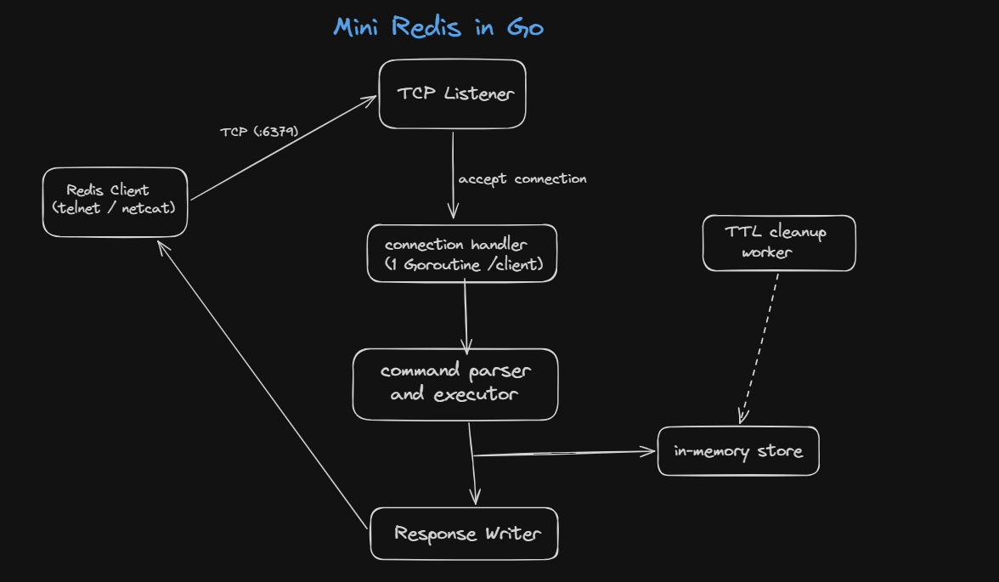

# Mini Redis in Go

A lightweight Redis-inspired key-value store built in Go for learning backend systems and Go fundamentals.

This project implements a subset of Redis commands over TCP while focusing on networking, concurrency, synchronization, and clean server design using only Go's standard library

---

## Features

- Supports multiple concurrent client connections using goroutines
- Thread-safe in-memory store using `sync.RWMutex`
- TTL support with automatic background cleanup of expired keys
- Supports core Redis commands: `PING`, `SET`, `GET`, `DEL`, `EXISTS`, `COUNT`, `KEYS`, and `EXPIRE`
- Graceful shutdown with proper connection cleanup
- Unit tests for command execution and store operations

---

## Architecture

The server listens for TCP connections and creates a dedicated goroutine for each client. Incoming commands are parsed, executed against the in-memory store, and responses are sent back to the client. Shared data is protected using a read-write mutex, while a background worker periodically removes expired keys.

> **Architecture Diagram**

<p align="center">
  
</p>

---

## Supported Redis Commands

| Command              | Description                            | Response                           |
| -------------------- | -------------------------------------- | ---------------------------------- |
| `PING`               | Check server availability              | `PONG`                             |
| `SET key value`      | Store a key-value pair                 | `OK`                               |
| `GET key`            | Retrieve the value for a key           | `<value>` or `NIL`                 |
| `DEL key`            | Delete a key                           | `DELETED` or `Key not found`       |
| `EXISTS key`         | Check whether a key exists             | `1` or `0`                         |
| `COUNT`              | Return the total number of stored keys | `<count>`                          |
| `KEYS`               | List all stored keys                   | `key1 key2 ...` or `No keys found` |
| `EXPIRE key seconds` | Set a TTL on a key                     | `OK` or `Key not found`            |

---

## How to Run

### Clone the repository

```bash
git clone https://github.com/SarthakShrivastava-04/mini-redis.git
cd mini-redis
```

### Run the server

```bash
go run .
```

The server starts on:

```text
localhost:6379
```

### Connect using Telnet

```bash
telnet localhost 6379
```

or using Netcat:

```bash
nc localhost 6379
```

Example:

```text
PING
PONG

SET name sarthak
OK

GET name
sarthak

EXISTS name
1

DEL name
DELETED
```
